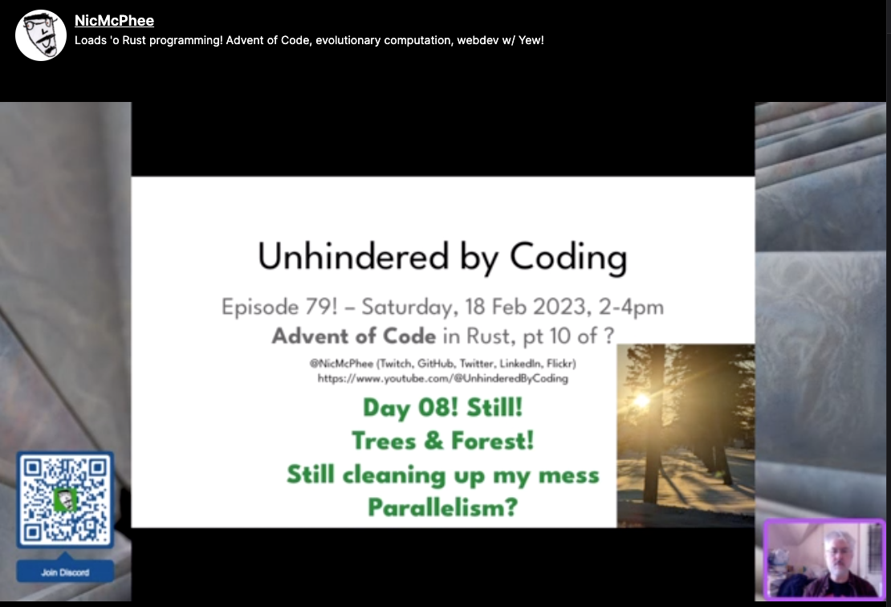

# My 2022 Advent of Code solutions in Rust (& Clojure)

When I started [the 2022 Advent of Code problems](https://adventofcode.com/2022)
in December 2022 I was comparing solutions in
[Clojure](./clojure-advent) and [Rust](./rust-advent/).
I only got a few (4 or 5) problems in during the first few weeks
of December because of time constraints. After coming back from
the winter holidays, though, I decided to to start spending two
of my four [Twitch streaming sessions](https://Twitch.tv/NicMcPhee)
on working through these problems in Rust. So there will be more
[Rust solutions](./rust-advent/) than
[Clojure solutions](./clojure-advent/), at least for the moment.

The relevant stream videos have been posted on YouTube on
[this playlist](https://www.youtube.com/watch?v=S7KOEJZB0UQ&list=PLI9i5fpXEEc4JIcLjwRF0XuerU7WpkWsA)
in case you want to go back and watch the development of the
solutions.
